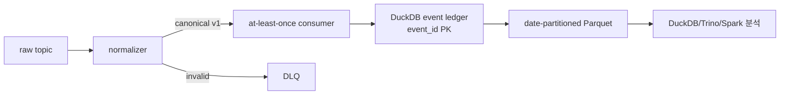

# Kafka 이벤트 → Parquet 분석 저장소 실습

기존 Kafka 흐름은 원천 이벤트를 정규화하고, 잘못된 메시지는 DLQ로 보내며,
DuckDB sink에서 `event_id` 중복을 막았다. 이 실습은 그 다음 경계를 작은 로컬
실행으로 검증한다.



## 실행 예시

```bash
python -m unittest discover -s tests -v
```

`services.lake_sink.write_canonical_events`는 canonical event 목록과 `batch_id`를
받아 `batch_id=<id>/event_date=YYYY-MM-DD/*.parquet` 형태로 저장한다. 같은 배치를
재실행하면 export 장부를 확인하고 동일 결과를 돌려준다. 다른 배치에서 같은
`event_id`가 다시 들어와도 DuckDB PK 때문에 저장되지 않는다.

## 운영 의미

- Kafka consumer는 여전히 at-least-once다. offset commit과 Parquet 파일 commit이
  하나의 트랜잭션이 아니므로 exactly-once라고 부르지 않는다.
- `event_id`는 원천 업무 키에 기반한 멱등 키이며, DB ledger는 재처리 경계를 보여준다.
- 날짜 파티션은 조회량을 줄이지만, 작은 파일이 많아지면 compact 작업이 필요하다.
- 운영 전환 시 DuckDB ledger는 Iceberg snapshot/metadata와 체크포인트로 교체하고,
  schema registry의 호환성 검사와 파티션별 freshness·consumer lag 지표를 추가한다.
- 원천 offset, topic, partition을 Parquet에 같이 남겨 데이터 계보와 장애 재현에 사용한다.
